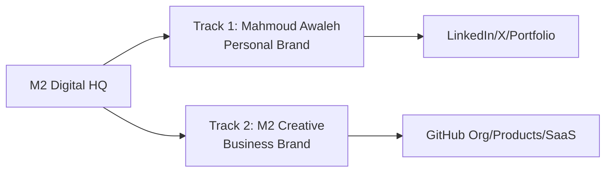

# 🚀 M2 GLOBAL DIGITAL BRAND TRANSFORMATION

## Master Blueprint & Core Agent Deep-Dive

**Owner:** Mahmoud Awaleh  
**Mission:** Achieve **Global Top 10** digital presence standards  
**Timeline:** 24 Hours (Critical) → 7 Days (Full Deployment)

---

## 🎯 Dual-Track Strategy



| Track | Focus | Platforms | Goal |
|-------|-------|-----------|------|
| **Personal** | Thought leadership, AI expertise | LinkedIn, X, Instagram, Portfolio | Verified creator status |
| **Business** | Products, SaaS, Client work | GitHub, Behance, Product sites | Global tech brand |

---

## 🤖 Core Agent Team Configuration

### 🕵️ Agent 1: THE CRAWLER
**Role:** Web Intelligence & Brand Extraction

```yaml
name: crawler_agent
capabilities:
  - Crawl top creator profiles (Gary Vee, Justin Welsh, Ali Abdaal)
  - Extract brand tokens (colors, fonts, UI patterns)
  - Audit existing profiles for gaps
  - Benchmark global tech founders
  
tools:
  - read_url_content
  - browser_subagent
  - grep_search
  
outputs:
  - /brain/brand_tokens.json
  - /brain/competitor_audit.md
  - /brain/profile_gaps.md
```

---

### 📝 Agent 2: THE ARCHITECT  
**Role:** System Designer & Brand Specs

```yaml
name: architect_agent
capabilities:
  - Ingest Crawler data
  - Design unified brand system
  - Create platform-specific templates
  - Define content calendar structure
  
tools:
  - write_to_file
  - generate_image
  - view_file
  
outputs:
  - /brain/BRAND_SYSTEM.md
  - /brain/CONTENT_CALENDAR.md
  - /brain/PLATFORM_SPECS/
```

---

### 🎨 Agent 3: THE BRAND AGENT
**Role:** Visual Identity & Asset Creation

```yaml
name: brand_agent
capabilities:
  - Generate profile banners
  - Create social media templates
  - Design GitHub profile READMEs
  - Produce Behance case studies
  
tools:
  - generate_image
  - write_to_file
  - mcp_github (push files)
  
outputs:
  - Profile banners (1500x500)
  - Avatar variations
  - Social templates
  - README graphics
```

---

### 📧 Agent 4: THE MAILER
**Role:** Communication & Outreach Automation

```yaml
name: mailer_agent
capabilities:
  - Draft verification request emails
  - Create platform bios (copy-ready)
  - Generate announcement posts
  - Prepare LinkedIn articles
  
tools:
  - write_to_file
  
outputs:
  - /brain/COPY_LIBRARY/
  - /brain/EMAIL_TEMPLATES/
  - /brain/POST_DRAFTS/
```

---

### 📈 Agent 5: THE GROWTH AGENT
**Role:** SEO, Analytics & Verification

```yaml
name: growth_agent
capabilities:
  - Optimize profiles for search
  - Track verification status
  - Generate SEO-rich descriptions
  - Create backlink strategy
  
tools:
  - search_web
  - read_url_content
  - write_to_file
  
outputs:
  - /brain/SEO_CHECKLIST.md
  - /brain/VERIFICATION_TRACKER.md
```

---

## ⏰ 24-HOUR SPRINT (Critical Path)

| Hour | Agent | Task | Deliverable |
|------|-------|------|-------------|
| 0-2 | Crawler | Audit all existing profiles | `profile_gaps.md` |
| 2-4 | Architect | Design unified brand tokens | `BRAND_SYSTEM.md` |
| 4-8 | Brand Agent | Generate all profile assets | Banners, avatars |
| 8-12 | Mailer | Write all platform bios | `COPY_LIBRARY/` |
| 12-16 | Growth Agent | SEO optimization | `SEO_CHECKLIST.md` |
| 16-20 | All Agents | Deploy to platforms | Live updates |
| 20-24 | QA | Verify all changes | `DEPLOYMENT_LOG.md` |

---

## 📅 7-DAY ROADMAP

| Day | Mahmoud Awaleh (Personal) | M2 Creative (Business) |
|-----|---------------------------|------------------------|
| **1** | ✅ Profile audit complete | ✅ GitHub org audit |
| **2** | ✅ All bios updated | ✅ README badges |
| **3** | ✅ Banners deployed | ✅ CI/CD pipelines |
| **4** | ✅ Portfolio populated | ✅ Behance cases |
| **5** | ✅ LinkedIn verification request | ✅ Product Hunt prep |
| **6** | ✅ Content calendar live | ✅ Documentation complete |
| **7** | ✅ YouTube channel created | ✅ Global launch ready |

---

## 📋 Platform Checklist

### Mahmoud Awaleh (Personal)

| Platform | Current | Target | Priority |
|----------|---------|--------|----------|
| LinkedIn | ✅ Exists | 🔵 Verified creator | 🔴 HIGH |
| Twitter/X | ✅ Exists | 🔵 Verified | 🔴 HIGH |
| Instagram | ✅ Exists | 🔵 Creator account | 🟡 MED |
| GitHub | ✅ mahmoudawaleh | 🔵 Profile README | 🔴 HIGH |
| Portfolio | ⚠️ Basic | 🔵 Premium showcase | 🔴 HIGH |
| YouTube | ❌ None | 🔵 M2 Creative Studio | 🔴 HIGH |
| Behance | ❌ None | 🔵 Design portfolio | 🟡 MED |
| Medium | ❌ None | 🔵 Tech articles | 🟢 LOW |

### M2 Creative (Business)

| Asset | Current | Target | Priority |
|-------|---------|--------|----------|
| GitHub Org | ✅ m2creativeplus | 🔵 Polished READMEs | 🔴 HIGH |
| CI/CD | ❌ None | 🔵 GitHub Actions | 🔴 HIGH |
| Docs | ⚠️ Partial | 🔵 Comprehensive | 🔴 HIGH |
| Brand Kit | ❌ None | 🔵 Figma + Assets | 🟡 MED |
| Product Hunt | ❌ None | 🔵 Launch ready | 🟡 MED |

---

## 🔐 Verification Strategy

| Platform | Method | Timeline |
|----------|--------|----------|
| LinkedIn | Creator Mode + Company Page | Week 1 |
| Twitter/X | Blue subscription | Day 1 |
| Instagram | Professional account switch | Day 2 |
| GitHub | Profile README + Org branding | Day 1 |
| YouTube | Channel verification (1000 subs) | Month 1 |

---

## User Review Required

> [!IMPORTANT]
> This is an ambitious 24-hour sprint. Please confirm:
> 1. **Proceed with full execution?**
> 2. **Any platforms to deprioritize?**
> 3. **Budget for X Blue / YouTube verification?**
