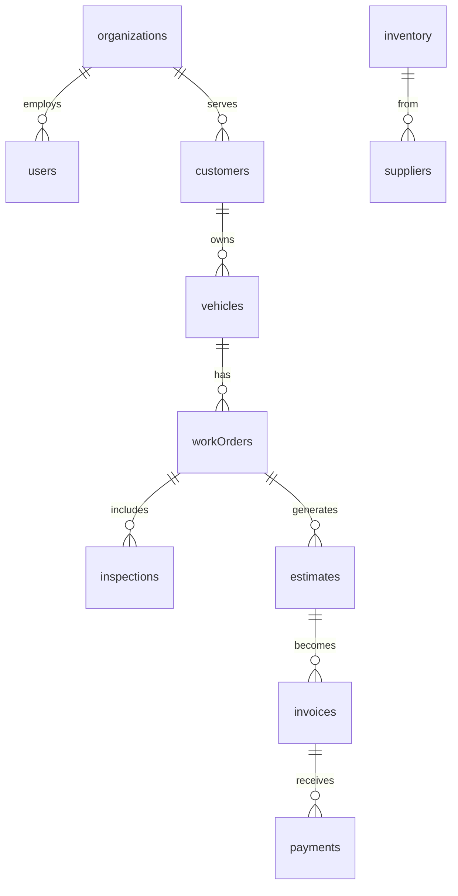

# MASS OSS Database Schema

> Convex Real-time Database | 24+ Tables | Multi-tenant

---

## Schema Overview



---

## Core Tables

### 1. Users & Auth

| Table | Purpose | Key Fields |
|-------|---------|------------|
| `users` | Staff profiles | email, role, department, certifications |
| `organizations` | Tenant isolation | name, slug, plan, ownerId |
| `userOrgRoles` | Permissions | userId, orgId, role, department |

**50+ Job Roles:** SUPER_ADMIN, OWNER, SERVICE_MANAGER, MASTER_TECH, DIAG_TECH, BODY_TECH, PAINTER, etc.

---

### 2. CRM

| Table | Purpose | Key Fields |
|-------|---------|------------|
| `customers` | Customer records | name, email, phone, preferredContact |
| `vehicles` | Fleet registry | make, model, year, VIN, mileage, status |

**Vehicle Statuses:** `active`, `in-service`, `delivered`, `inactive`

---

### 3. Operations

| Table | Purpose | Key Fields |
|-------|---------|------------|
| `appointments` | Scheduling | customerId, vehicleId, date, status |
| `workOrders` | Job cards | jobNumber, status, services, diagnosis |
| `inspections` | DVI reports | items[], overallCondition, safetyRating |
| `estimates` | Quotes | lineItems[], status, totalAmount |
| `invoices` | Billing | lineItems[], paidAmount, balanceDue |

**Work Order Statuses:** `check-in` → `inspecting` → `awaiting-approval` → `in-progress` → `waiting-parts` → `complete` → `invoiced`

---

### 4. Inventory

| Table | Purpose | Key Fields |
|-------|---------|------------|
| `inventory` | Parts catalog | partNumber, stockQuantity, costPrice, sellingPrice |
| `suppliers` | Vendors | name, contactPerson, paymentTerms |
| `purchaseOrders` | Stock orders | items[], status, expectedDate |
| `laborGuide` | Service ops | operationCode, standardHours, skillLevel |

---

### 5. Finance

| Table | Purpose | Key Fields |
|-------|---------|------------|
| `sales` | POS transactions | items[], paymentMethod, totalAmount |
| `payments` | Payment tracking | invoiceId, amount, method (zaad/edahab/cash) |
| `expenses` | Operating costs | category, amount, receiptUrl |
| `expenseCategories` | Cost types | name, type (overhead/cogs/labor) |

**Payment Methods:** `cash`, `zaad`, `edahab`, `card`, `bank-transfer`

---

### 6. Somaliland Market

| Table | Purpose | Key Fields |
|-------|---------|------------|
| `automotivePois` | Directory | businessName, category, city, rating |
| `sparePartsMaster` | Parts catalog | partNumber, compatibleModels, landedCostUsd |
| `marketPriceIntelligence` | Pricing | fobPriceUsd, streetPriceUsd |
| `massPartners` | B2B network | partnerType, fleetSize, partnershipStatus |

---

## Index Strategy

All tables include org-based indexes for tenant isolation:
```typescript
.index("by_org", ["orgId"])
```

Common query patterns:
- `by_customer`, `by_vehicle`, `by_status`
- `by_date`, `by_technician`
- `by_partNumber`, `by_category`

---

## Multi-Tenant Architecture

```
┌─────────────────────────────────────┐
│           Organization A            │
│  ┌─────┐  ┌─────┐  ┌─────┐        │
│  │Users│  │Cust.│  │Vehic│  ...    │
│  └─────┘  └─────┘  └─────┘        │
├─────────────────────────────────────┤
│           Organization B            │
│  ┌─────┐  ┌─────┐  ┌─────┐        │
│  │Users│  │Cust.│  │Vehic│  ...    │
│  └─────┘  └─────┘  └─────┘        │
└─────────────────────────────────────┘
```

All queries filtered by `orgId` for data isolation.
