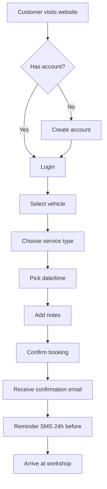
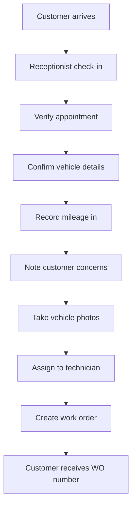
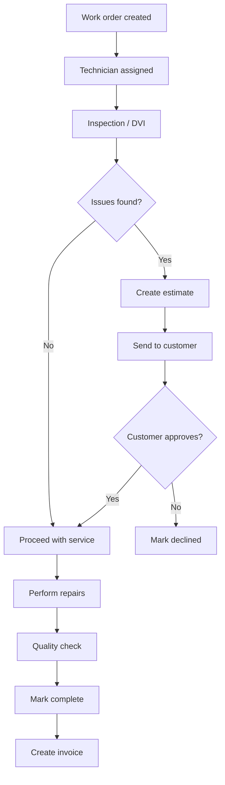
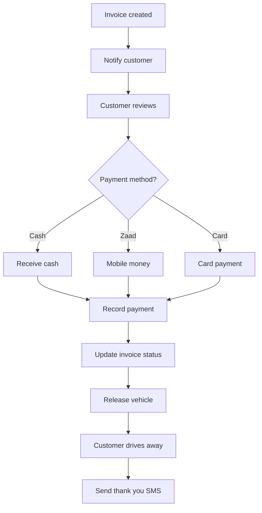
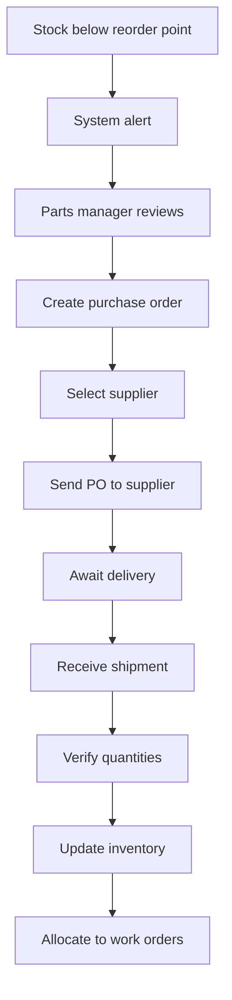

# MASS OSS Complete Workflows

> All business processes and user journeys

---

## Customer Journey Workflows

### 1. Appointment Booking Flow


### 2. Vehicle Check-In Flow


### 3. Service Flow


### 4. Payment & Checkout Flow


---

## Staff Workflows

### 5. Daily Opening Procedure
```
1. ☐ Open POS system
2. ☐ Check today's appointments
3. ☐ Review pending work orders
4. ☐ Check parts inventory alerts
5. ☐ Assign technician schedules
6. ☐ Review yesterday's incomplete jobs
7. ☐ Brief morning standup
```

### 6. Work Order Lifecycle
```
Status Flow:
check-in → inspecting → awaiting-approval → in-progress → waiting-parts → complete → invoiced

Transitions:
┌──────────┬─────────────────────────────────────────────────────────┐
│ Status   │ Next Actions                                           │
├──────────┼─────────────────────────────────────────────────────────┤
│ check-in │ Start inspection, assign technician                    │
│ inspect  │ Create estimate, note findings                         │
│ awaiting │ Wait for customer approval                             │
│ progress │ Perform repairs, request parts                         │
│ waiting  │ Order parts, track delivery                            │
│ complete │ QC check, create invoice                               │
│ invoiced │ Collect payment, release vehicle                       │
└──────────┴─────────────────────────────────────────────────────────┘
```

### 7. Digital Vehicle Inspection (DVI)
```
Inspection Checklist Categories:

EXTERIOR
☐ Body condition (dents, scratches)
☐ Lights (all working)
☐ Windshield (chips, cracks)
☐ Mirrors
☐ Wipers

ENGINE BAY
☐ Oil level & condition
☐ Coolant level
☐ Brake fluid
☐ Battery terminals
☐ Belts & hoses
☐ Air filter

UNDERCARRIAGE
☐ Brake pads (mm remaining)
☐ Rotors condition
☐ Suspension components
☐ Exhaust system
☐ Fluid leaks

INTERIOR
☐ Dashboard warning lights
☐ AC operation
☐ Seat belts
☐ Horn
☐ Power windows

TIRES
☐ Tread depth (mm)
☐ Tire pressure
☐ Spare tire
☐ Wheel alignment visual

Status Options:
✅ OK - No action needed
⚠️ Monitor - Future service recommended
🔴 Immediate - Safety concern, needs repair
```

### 8. Parts Ordering Flow


---

## AI-Powered Workflows

### 9. VIN Auto-Lookup Flow
```
1. Customer provides VIN
2. System validates format (17 chars)
3. Call NHTSA vPIC API
4. Extract: Make, Model, Year, Engine
5. Auto-fill vehicle form
6. Check if Japanese origin (starts with J)
7. Show Japan badge if applicable
8. Save vehicle record
```

### 10. OBD Diagnostics Flow
```
1. Connect OBD scanner to vehicle
2. Read trouble codes (P0300, etc.)
3. Enter code in MASS OSS
4. System decodes:
   - Description
   - Possible causes
   - Severity level
   - Common parts needed
   - Estimated labor hours
5. Add to work order recommendations
6. Include in estimate
```

### 11. AI Image Diagnostics
```
1. Technician photographs part
2. Upload to diagnostics module
3. Add context (symptoms, concerns)
4. AI (Gemini) analyzes image
5. Returns:
   - Part identification
   - Condition assessment
   - Issues detected
   - Recommendations
   - Estimated repair cost
6. Auto-create estimate line item
```

---

## Financial Workflows

### 12. Invoice Generation
```
From Work Order:
1. Work order marked complete
2. Click "Create Invoice"
3. System pulls:
   - All parts used
   - Labor hours logged
   - Applied discounts
4. Calculate subtotal
5. Apply taxes
6. Generate invoice number
7. Save and optionally send
```

### 13. Payment Recording
```
1. Customer ready to pay
2. Open invoice
3. Select payment method
4. Enter amount (supports split payments)
5. Record reference (Zaad TXN, card auth)
6. Update invoice:
   - Full payment → PAID
   - Partial → PARTIAL
7. Print receipt
8. Update daily cash report
```

---

## Reporting Workflows

### 14. Daily Reports
```
End of Day:
1. POS closing - count cash drawer
2. Reconcile with system totals
3. Print/export daily summary:
   - Total revenue
   - Jobs completed
   - Parts sold
   - Outstanding invoices
4. Manager review and sign-off
```

### 15. Monthly Reports
```
Executive Dashboard:
- Revenue trend (vs last month)
- Average repair order value
- Customer acquisition
- Parts turnover rate
- Technician productivity
- Outstanding AR aging
```

---

## Notification Triggers

| Event | Channel | Recipient | Timing |
|-------|---------|-----------|--------|
| Appointment booked | Email + SMS | Customer | Immediate |
| Appointment reminder | SMS | Customer | 24h before |
| Estimate ready | Email | Customer | Immediate |
| Estimate approved | In-app | Service advisor | Immediate |
| Vehicle ready | SMS | Customer | Immediate |
| Invoice created | Email | Customer | Immediate |
| Payment received | Email | Customer | Immediate |
| Service due reminder | SMS | Customer | Based on schedule |
| Low stock alert | In-app | Parts manager | When below threshold |

---

## Emergency Workflows

### Roadside Assistance
```
1. Customer calls emergency line
2. Capture location (GPS/address)
3. Record vehicle details
4. Dispatch tow truck / mobile unit
5. Create priority work order
6. Track arrival ETA
7. Complete service
8. Follow-up call next day
```
