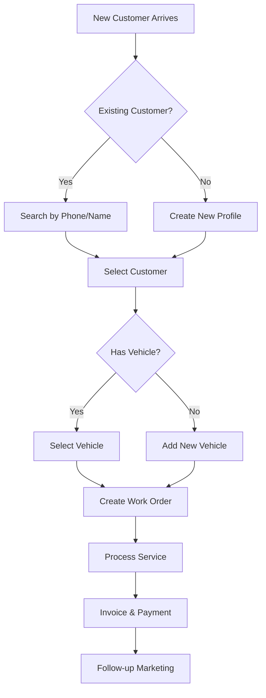

# MASS OSS - Complete Workflow Documentation

## Business Process Flows for 300-450 Somaliland Garages

---

## 1. Customer Lifecycle Workflow



---

## 2. Work Order Workflow

### 2.1 Status Flow

```
CHECK-IN → INSPECTING → AWAITING APPROVAL → IN PROGRESS → COMPLETE → INVOICED
                ↓                ↓                ↓
           [DECLINED]      [WAITING PARTS]   [CANCELLED]
```

### 2.2 Step-by-Step Process

| Step | Actor | Action | System Update |
|------|-------|--------|---------------|
| 1 | Staff | Create work order | Status: Check-In |
| 2 | Tech | Start DVI inspection | Status: Inspecting |
| 3 | Tech | Complete inspection | Estimate auto-created |
| 4 | Staff | Send estimate to customer | Status: Awaiting Approval |
| 5 | Customer | Approve/Decline items | Status: In Progress or stays |
| 6 | Staff | Order needed parts | Status: Waiting Parts (if needed) |
| 7 | Tech | Perform repairs | Progress updated |
| 8 | Tech | Mark work complete | Status: Complete |
| 9 | Staff | Generate invoice | Status: Invoiced |
| 10 | Staff | Collect payment | Payment recorded |

---

## 3. Digital Vehicle Inspection (DVI) Workflow

### 3.1 Inspection Process

```
1. SELECT TEMPLATE
   ├── 18-Point Inspection (Standard)
   ├── Pre-Purchase Inspection
   ├── AC System Check
   └── Custom Template

2. INSPECT EACH SECTION
   ├── Exterior (4 items)
   ├── Under Hood (6 items)
   ├── Interior (4 items)
   └── Under Vehicle (4 items)

3. FOR EACH ITEM
   ├── ✅ OK (Green) - No action
   ├── ⚠️ Attention (Yellow) - Recommend
   └── 🔴 Immediate (Red) - Required

4. ADD EVIDENCE
   ├── Take photos
   ├── Add notes
   └── Select canned job (if applicable)

5. SUBMIT INSPECTION
   └── Auto-generates estimate with all items
```

### 3.2 Inspection to Estimate Flow

| Inspection Rating | Estimate Action |
|-------------------|-----------------|
| ✅ OK | Not added to estimate |
| ⚠️ Attention | Added as optional |
| 🔴 Immediate | Added as required |

---

## 4. Estimate & Approval Workflow

### 4.1 Estimate Creation

```
LINE ITEM TYPES:
├── Labor (Hours × Rate)
├── Parts (Qty × Price + Markup)
├── Sublet (External services)
└── Miscellaneous (Fees, disposal)

CALCULATIONS:
└── Subtotal = Sum of all items
└── Discount = Manual or % off
└── Tax = Configurable rate
└── Total = Subtotal - Discount + Tax
```

### 4.2 Customer Approval Options

| Method | How |
|--------|-----|
| **SMS** | Send link, customer clicks to approve |
| **WhatsApp** | Share estimate, get reply approval |
| **Email** | PDF attachment with approval link |
| **In-Person** | Customer signs on device |

### 4.3 Approval States

```
DRAFT → SENT → VIEWED → APPROVED/DECLINED → EXPIRED
                              ↓
                          [REVISED] → SENT again
```

---

## 5. Inventory & Parts Workflow

### 5.1 Stock Management

```
STOCK INCREASES:
├── Purchase Order received
├── Manual adjustment (audit)
└── Return to stock (unused parts)

STOCK DECREASES:
├── Added to work order
├── POS counter sale
├── Manual adjustment (damage/theft)
└── Transfer to other location
```

### 5.2 Purchase Order Flow

```
1. LOW STOCK ALERT
   ↓
2. CREATE PURCHASE ORDER
   ├── Select supplier
   ├── Add items
   └── Set quantities
   ↓
3. SEND TO SUPPLIER
   ↓
4. RECEIVE GOODS
   ├── Partial receive (multiple deliveries)
   └── Full receive
   ↓
5. STOCK AUTO-UPDATES
```

---

## 6. Payment Processing Workflow

### 6.1 Accepted Payment Methods

| Method | Process |
|--------|---------|
| **Cash** | Count, record, issue receipt |
| **ZAAD** | Customer sends to shop number, record reference |
| **eDahab** | Customer sends to shop number, record reference |
| **Card** | Swipe/tap, record transaction ID |
| **Bank Transfer** | Receive confirmation, record reference |

### 6.2 Split Payment Flow

```
INVOICE TOTAL: $500
├── Payment 1: ZAAD $200 (Reference: 12345)
├── Payment 2: Cash $150
└── Payment 3: eDahab $150 (Reference: 67890)
BALANCE: $0.00 ✓
```

---

## 7. Appointment Booking Workflow

### 7.1 Booking Sources

```
APPOINTMENT SOURCES:
├── Walk-in (Staff creates)
├── Phone call (Staff creates)
├── Customer Portal (Self-service)
└── Marketing campaign (Auto-generated)
```

### 7.2 Appointment Lifecycle

```
SCHEDULED → CONFIRMED → IN PROGRESS → COMPLETED
    ↓           ↓
[CANCELLED] [NO-SHOW]
```

### 7.3 Reminder Automation

| Timing | Channel | Purpose |
|--------|---------|---------|
| 48 hours before | SMS | Confirm attendance |
| 24 hours before | WhatsApp | Reminder |
| 2 hours before | SMS | Final reminder |
| After no-show | Call | Reschedule |

---

## 8. Reporting Workflow

### 8.1 Daily Reports

```
End of Day:
├── Revenue summary
├── Work orders completed
├── Payments received
└── Outstanding balances
```

### 8.2 Weekly Reports

```
Weekly Review:
├── Top services performed
├── Technician productivity
├── Parts usage
└── Customer acquisition
```

### 8.3 Monthly Reports

```
Monthly Analysis:
├── P&L statement
├── Gross profit by service
├── Inventory turnover
└── Customer retention
```

---

## 9. Multi-Location Workflow

### 9.1 Network Management

```
HQ (Main Location)
├── Location 1 (Hargeisa)
├── Location 2 (Burao)
└── Location 3 (Berbera)

SHARED:
├── Customer database
├── Inventory (can transfer)
└── Pricing rules

SEPARATE:
├── Work orders
├── Staff assignments
└── Cash registers
```

---

## 10. Affiliate/Referral Workflow

### 10.1 Partner Referral Process

```
1. Partner shares referral code
   ↓
2. New customer uses code at booking
   ↓
3. System records referral source
   ↓
4. Service completed & paid
   ↓
5. Commission calculated (5-7%)
   ↓
6. Added to partner balance
   ↓
7. Partner requests payout
   ↓
8. Payment sent via ZAAD/eDahab
```

---

**Process Efficiency Target:** < 30 minutes per complete check-in to estimate workflow

**MASS OSS** - Streamlined Operations for Every Garage 🔧
